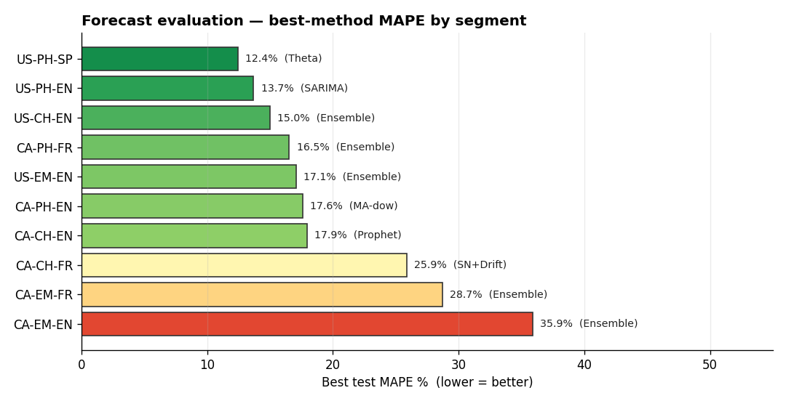
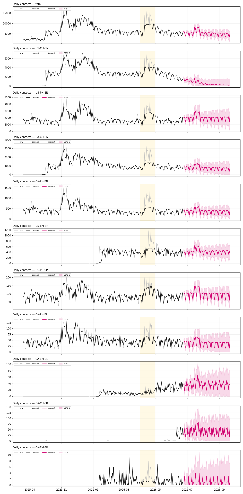

# Sephora Contact-Volume Forecaster

Forecasts daily customer-contact volume for the **10 Country-Channel-Language
segments** (e.g. `US-PH-EN` = US / Phone / English) from the Gladly export
`Ss.xlsx`, with robust outlier normalization (extra damping for the **April
spring-sale surge**) and automatic daily retraining.

## Forecast granularity — the 10 segments

Each raw `(Channel, Country)` pair is mapped to a `COUNTRY-CHANNEL-LANG` code
(`PH`=Voice, `CH`=Chat, `EM`=Email; the language comes from the country field,
e.g. `US-EN`, `US-SP`, `CA-FR`). The aggregate country=`ALL` chat bucket is
**dropped**. This yields exactly 10 segments, plus a `total` = their sum:

| Voice | Chat | Email |
|-------|------|-------|
| US-PH-EN, US-PH-SP, CA-PH-EN, CA-PH-FR | US-CH-EN, CA-CH-EN, CA-CH-FR | US-EM-EN, CA-EM-EN, CA-EM-FR |

## What it does

1. **Ingest** — reads the raw `Voice Export` and `Email_Chat Export` sheets,
   maps each row to its segment (dropping `ALL`), and aggregates to a daily
   series per segment.
2. **Trim launch + fill gaps** — drops each segment's dead pre-launch zero
   period (several queues, e.g. US-EM-EN and CA-CH-FR, went live mid-history),
   then imputes missing calendar days (e.g. the 2025-12-25 Christmas gap) using
   the same-weekday local median so weekly seasonality is preserved.
3. **Normalize outliers (April-aware)** — see below.
4. **Back-test & select model** — holds out the last 28 days, back-tests ten
   candidate models, and keeps the most accurate one *per segment* (by MAPE).
5. **Forecast** — refits the winner on all cleaned data (with orders + event
   drivers) and projects the next 90 days (3 months) with an 80% interval.
6. **Persist** — writes every artifact to `outputs/` so a scheduler can rerun
   it unattended.

Very thin queues (< 5 contacts/day) and recently-launched ones are restricted to
seasonal-naive, and all forecasts are capped at 1.5x the recent 8-week peak, so
trend/drift models can never extrapolate absurd values on sparse data.

## Outlier normalization (and April)

A 2-week sustained April surge would normally pull a trend estimate *up* into the
surge, so nothing looks anomalous. To avoid that the pipeline:

- Blanks the known event windows (April sale + Nov/Dec holiday), rebuilds a clean
  **baseline** (robust weekly STL) across them, so the baseline is *not* inflated
  by the surge.
- **Statistical outliers** (robust z > 4 *and* >40% off baseline, outside events)
  are replaced with the baseline expectation.
- **April promo days** are winsorized: anything above `baseline × 1.35` is capped
  down to that level — this damps the *entire* surge, not just the tallest day
  (e.g. 16,048 → ~9,458 on 2026-04-14 while the baseline stays ~7,000).
- Nov/Dec holiday spikes are only lightly clipped (`× 2.2`) so the genuine season
  is retained.

All decisions are logged per day in `outputs/cleaning_<channel>.csv`
(`raw`, `baseline`, `robust_z`, `stat_outlier`, `april_capped`, `clean`).

Tune in `forecast_pipeline.py`: `Z_THRESH`, `REL_THRESH`, `APRIL_CAP`,
`APRIL_MONTHS`, `EVENT_WINDOWS`.

## Models — 10 candidates compared on the test set

Every segment is back-tested with **9 methods plus an ensemble**; the one with the
lowest hold-out MAPE wins and is used for the future forecast (guaranteeing the
shipped forecast is never worse than the naive baseline):

1. **Seasonal Naive** — repeat last week
2. **Seasonal Naive + Drift** — plus weekly level trend
3. **Moving Avg (by weekday)** — mean of last 4 same-weekday values
4. **Holt-Winters (ETS)** — damped additive trend + weekly seasonal
5. **SARIMA** — airline (0,1,1)(0,1,1)₇
6. **Theta** — statsmodels ThetaModel
7. **Linear Regression** — day-of-week one-hot + linear trend
8. **Gradient Boosting** — same calendar features, boosted trees
9. **Prophet** — Facebook Prophet, weekly seasonality (+ orders as a regressor)
10. **Ensemble** — mean of the top-2/3 methods per segment (forecast combination)

Two accuracy refinements minimize MAPE: SARIMA / Theta / Holt-Winters each fit on
the **raw or log1p** series (chosen on an internal validation slice, no leakage),
and the winner is selected by **lowest hold-out MAPE** (the metric being
optimized), with a WAPE fallback for near-zero queues.

## Evaluation — test-set MAPE % by segment

Back-test on the last **28 days** (hold-out). Lower is better; the **bold** cell
is the best (lowest MAPE) method for that segment. `–` = the method could not be
fit for that series (too few points on a launched queue).

| Segment | avg/day | SNaive | SN+Drift | MA-dow | Holt-W | SARIMA | Theta | LinReg | GBoost | Prophet | **Ensemble** |
|---------|--:|--:|--:|--:|--:|--:|--:|--:|--:|--:|--:|
| **total** | 6695 | 12.4 | 14.2 | 24.8 | 18.0 | **12.3** | 25.1 | 60.9 | 21.7 | 31.0 | 12.3 |
| US-CH-EN | 2875 | 29.2 | 23.2 | 57.3 | 31.9 | 17.3 | 34.9 | 69.8 | 34.2 | 62.1 | **15.0** |
| US-PH-EN | 1916 | 17.5 | 21.8 | 17.1 | 14.4 | **13.7** | 13.7 | 25.5 | 21.8 | 14.1 | 13.7 |
| CA-CH-EN | 1057 | 23.5 | 66.6 | 18.1 | 38.7 | 46.2 | 37.5 | 22.8 | 26.4 | **17.9** | 18.0 |
| CA-PH-EN | 465 | 24.7 | 53.8 | **17.6** | 25.1 | 25.5 | 25.4 | 18.6 | 24.6 | 17.9 | 17.7 |
| US-EM-EN | 225 | 32.7 | 50.9 | 21.6 | 19.4 | 23.2 | 18.8 | 41.0 | 19.7 | 36.2 | **17.1** |
| US-PH-SP | 92 | 17.0 | 16.6 | 17.2 | 12.6 | 12.7 | **12.4** | 17.6 | 14.9 | 14.8 | 12.5 |
| CA-PH-FR | 50 | 27.6 | 57.1 | 21.1 | 19.1 | 19.9 | 19.5 | 28.2 | 20.7 | 17.2 | **16.5** |
| CA-EM-EN | 8 | 39.7 | 80.7 | 36.7 | 42.9 | 51.3 | 47.0 | 39.3 | 54.9 | 45.8 | **35.9** |
| CA-CH-FR | 2 | 49.0 | **25.9** | 74.5 | 42.4 | 28.9 | 62.1 | 38.9 | 66.2 | 38.8 | 27.4 |
| CA-EM-FR | 0 | 48.1 | 98.7 | 49.2 | 34.1 | 33.9 | 29.1 | 37.8 | 32.1 | 39.2 | **28.7** |

The **Ensemble** (mean of the top-2/3 methods per segment) wins or ties most
segments; picking the lowest-MAPE method per segment brings the average best
MAPE down from **20.5% → 19.4%** (e.g. US-CH-EN 23.2% → **15.0%**).

Best MAPE per segment, at a glance:



Raw vs cleaned vs 90-day forecast for the total and all 10 segments (April promo
window shaded):



> The two micro-queues (CA-CH-FR, CA-EM-FR at ~1–2 contacts/day) show higher MAPE
> by nature — a ±1 contact error on a ~1/day mean is a large percentage even
> though the absolute error is tiny.

## Web UI

A Flask dashboard to explore the results:

```bat
python app.py            REM -> http://127.0.0.1:5056
```

**Segment detail** tab — pick any segment to see: the 10-candidate **test-set
accuracy table** (WAPE / MAPE / MAE / RMSE, best highlighted), a **test-window
chart** of actual vs every method (toggle methods on/off), and the **history +
90-day (3-month) forecast** with its 80% interval.

**Leaderboard** tab — a wins-per-method tally plus a full **WAPE % heat-map
matrix** (every segment × all 10 candidates, best per row in green, worse cells
tinted red). All 10 are scored for *every* segment, including the thin
launched queues.

**Data & Retrain** tab — add new data and produce a fresh 3-month forecast (see
below).

> Two "best" models are tracked per segment: the **test winner** (most accurate
> on the hold-out) and the **forecast model** actually used going forward. They
> match except on very thin/launched queues, where the forward forecast is
> pinned to seasonal-naive for safety (shown as a "forecast uses…" badge).

A "Retrain now" button reruns the whole pipeline on demand.

## Add new data → retrain → 3-month rolling forecast

The **Data & Retrain** UI tab (or the `data/` CSVs directly) lets you extend the
model with new input; **Retrain** rebuilds on the full dataset and produces a
**90-day (3-month) rolling forecast** starting the day after the last actual — so
as you keep adding data, the forecast window rolls forward.

### Import a file (Excel / CSV)

The **Import file** control uploads an `.xlsx`/`.csv` and auto-detects it:

- a **raw Gladly export** (an `.xlsx` with the `Voice Export (Gladly)` /
  `Email_Chat Export (Gladly)` sheets, like `Ss.xlsx`) → becomes the forecast
  **source** (`data/source.xlsx`), used on the next Retrain (revertible);
- a file with **`start,end,name[,impact_pct]`** → merged into the event calendar;
- **`date,orders`** → orders; **`date,segment,contacts`** → actuals.

`POST /api/upload` (multipart) does the same from code; `POST /api/source/reset`
reverts to the default `Ss.xlsx`.

Or add individual rows / a smaller amount of data through the three forms below.

### Download the forecast & the actuals template

The **Download** panel (Data & Retrain tab) provides two files:

- **Forecast (Excel)** — the current 3-month forecast: a wide `date × segment`
  sheet plus a detail sheet with the 80% interval (`GET /api/download/forecast`).
  Each Segment-detail view also has a **⬇ CSV** link for that one segment.
- **Actuals template (Excel)** — a blank sheet pre-filled with the forecast
  **dates** down the rows and a column per segment (`GET /api/download/template`).
  Fill in the actual contacts as they land, upload it via **Import file**, and
  **Retrain** — the model rebuilds and the 3-month window rolls forward. The
  template round-trips: the importer melts the wide grid back to actuals rows.

| Input | File | Effect |
|-------|------|--------|
| **New actuals** | `data/actuals.csv` (`date,segment,contacts`) | appended/overlaid onto the Excel history, extending the date range |
| **Orders** | `data/orders.csv` (`date,orders`) | a daily demand **driver** fed as an exogenous regressor to SARIMA + the two regression models; projected forward (or use your own future rows) so it informs the whole horizon |
| **Events** | `data/events.csv` (`start,end,name,impact_pct`) | a known-promo calendar; each event **lifts the future forecast** by `impact_pct` within its window (e.g. an April Spring Sale at +50%) |

So a known upcoming promo can be forecast explicitly rather than just normalized
out of history — e.g. adding a *Summer Promo, +40%* over Jul 15–25 raises those
days' forecast by 40% (visible as `event_factor` in `forecast_<segment>.csv`).

Endpoints (all POST JSON): `/api/actual`, `/api/order`, `/api/event`,
`/api/event/delete`, `/api/retrain`; `GET /api/data` returns the current calendar.

## Run it

```bat
REM one-off
python forecast_pipeline.py

REM custom source / horizon
python forecast_pipeline.py --xlsx "D:\path\Ss.xlsx" --horizon 45 --no-plot
```

## Automatic retraining

`run_forecast.bat` re-ingests, re-normalizes, retrains and re-forecasts, appending
to `outputs/run.log`. A Windows Scheduled Task named **"Sephora Contact Forecast"**
runs it **daily at 06:00**, so each time `Ss.xlsx` is refreshed with new days the
model retrains and the forecast rolls forward automatically.

```bat
schtasks /Query  /TN "Sephora Contact Forecast"     REM inspect
schtasks /Run    /TN "Sephora Contact Forecast"     REM run now
schtasks /Change /TN "Sephora Contact Forecast" /ST 07:30   REM retime
schtasks /Delete /TN "Sephora Contact Forecast" /F  REM remove
```

> The task points at `C:\Users\lenovo\Desktop\Ss.xlsx`. Keep overwriting that file
> with the latest export (same sheet names/columns) and the forecast stays current.

## Outputs (`outputs/`)

| File | Contents |
|------|----------|
| `daily_contacts.csv`      | daily `total` + per-segment history |
| `cleaning_<segment>.csv`  | per-day outlier decisions & cleaned values |
| `forecast_<segment>.csv`  | next 90 days: `forecast`, `lower_80`, `upper_80` |
| `forecast_plot.png`       | raw vs cleaned vs forecast, April window shaded |
| `summary.json`            | run metadata, per-segment best model & accuracy (WAPE) |
| `run.log`                 | scheduled-run history |

## Requirements

Python 3 with `pandas`, `numpy`, `statsmodels`, `matplotlib` (all already
installed on this machine).
